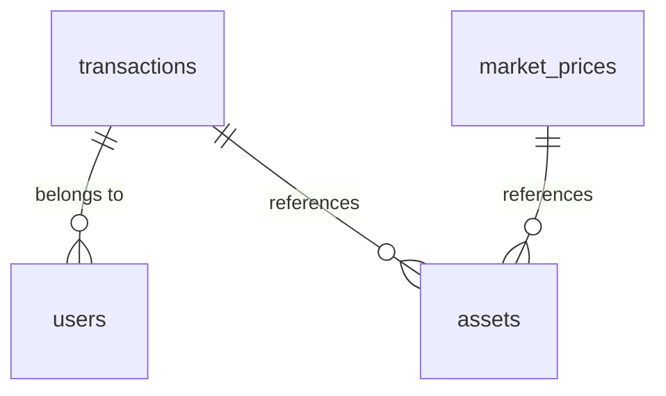

# 🏗️ SentinelSQL Data Architecture

## Overview
This document defines the schema, relationships, and ingestion strategy for the SentinelSQL fraud detection analytics platform.

## Schema Definitions

### Fact Tables

#### `transactions` (Fact)
| Column | Type | Description | Constraints |
|--------|------|-------------|-------------|
| trade_id | INTEGER | Unique trade identifier | PRIMARY KEY |
| user_id | INTEGER | User who initiated the trade | FOREIGN KEY to users (dim) |
| asset_id | VARCHAR | Cryptocurrency asset code | FOREIGN KEY to assets (dim) |
| amount | DOUBLE | Quantity of asset traded | NOT NULL |
| price | DOUBLE | Execution price per unit | NOT NULL |
| timestamp | TIMESTAMP | Trade execution time | NOT NULL |
| status | VARCHAR | Trade status (`completed`,`pending`,`failed`) | |

**Cardinality:** ~150,000 rows (30 days)
**Partitioning:** By `date(timestamp)` (daily)
**Clustering:** `(user_id, asset_id)`

#### `market_prices` (Fact)
| Column | Type | Description |
|--------|------|-------------|
| timestamp | TIMESTAMP | Minute‑level timestamp |
| asset_id | VARCHAR | Asset code |
| market_price | DOUBLE | Official market price at that minute |

**Cardinality:** ~259,200 rows (6 assets × 43,200 minutes)
**Partitioning:** By `asset_id` (columnar segment)

### Dimension Tables (Implicit)

#### `users` (Dimension)
- Derived from `transactions.user_id`
- No explicit table; attributes can be enriched later.

#### `assets` (Dimension)
- Static mapping of asset codes to metadata (name, category, launch date).
- Currently implicit.

## Table Relationships



## Primary Keys & Surrogate Keys

- `transactions.trade_id` is a natural primary key (sequential).
- No surrogate keys introduced; DuckDB’s row‑group identifiers serve for joins.

## Partitioning Strategy

**Goal:** Optimize for time‑series queries and columnar projection pushdown.

| Table | Partition Key | Rationale |
|-------|--------------|-----------|
| transactions | `date(timestamp)` | Daily time‑range queries dominate. |
| market_prices | `asset_id` | Prices are queried per‑asset. |

**Implementation:** Using DuckDB’s native Parquet partitioning:
```
sources/sentinel/transactions/
  date=2025-01-01/part-0.parquet
  date=2025-01-02/part-0.parquet
```

## Ingestion Logic

### 1. Raw Data Source
- Synthetic data generated by `generate_sentinel_data.py`
- Format: Parquet (compressed with Snappy)
- Location: `sources/sentinel/*.parquet`

### 2. DuckDB Ingestion
Two recommended patterns:

#### Pattern A: Direct Parquet Read (Zero‑Copy)
```sql
CREATE VIEW transactions AS
SELECT * FROM read_parquet('sources/sentinel/transactions.parquet');
```

#### Pattern B: Copy into Managed Table
```sql
COPY INTO transactions FROM 'sources/sentinel/transactions.parquet'
  (FORMAT PARQUET);
```

**Chosen approach:** Pattern A for this project, because:
- No data duplication
- Parquet columnar compression preserved
- DuckDB’s projection pushdown works directly on Parquet

### 3. Incremental Updates
For production, a daily incremental pipeline would:

```sql
-- Detect new files
INSERT INTO transactions
SELECT * FROM read_parquet('sources/sentinel/new_transactions_*.parquet')
WHERE trade_id NOT IN (SELECT trade_id FROM transactions);
```

## Performance Considerations

### Columnar Storage Benefits
- Parquet columnar format reduces I/O for analytical queries.
- Use `SELECT` with explicit columns only (no `SELECT *`).

### Predicate Pushdown
Queries with filters on `timestamp` or `asset_id` will skip entire row‑groups.

### Join Optimization
- `transactions` ↔ `market_prices` joined via `ASOF JOIN` for temporal alignment.
- Use `asset_id` as join key to leverage partitioning.

## Data Quality Checks

1. **Null Validation**: No NULLs in `trade_id`, `timestamp`.
2. **Referential Integrity**: All `asset_id` values exist in market prices.
3. **Temporal Consistency**: `transactions.timestamp` within market price range.

## Future Extensions

- Add `users` dimension with KYC attributes.
- Add `fraud_flags` fact table for ML predictions.
- Real‑time streaming via Apache Kafka → DuckDB.

---

*Architecture aligned with MIAGE Data Engineering standards – Charles Baudoux*